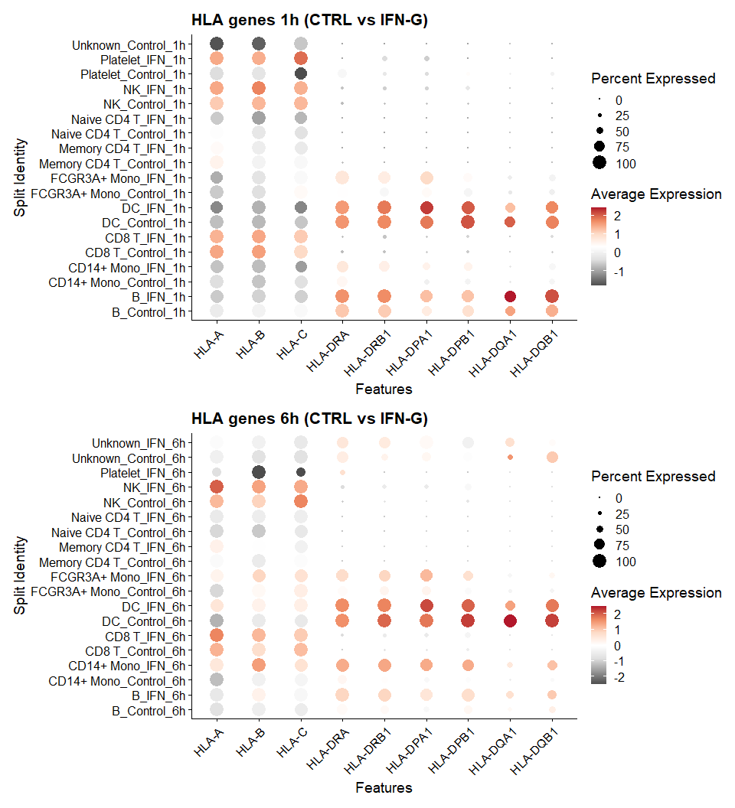

HLA expression on scRNA-seq data
================
Onur Özer
2025-09-08

There is a well-known text book knowledge: HLA class-I genes are
expressed in all cells containing nucleus, while HLA class-II genes are
mainly expressed in antigen-presenting cells (APCs).

Now that we have many available single-cell RNA sequencing data, we can
have a look at this again.

First, let’s load some libraries that will be used.

``` r
library(Seurat)
library(tidyverse)
library(patchwork)
library(SeuratData)
library(harmony)
library(Matrix)
```

Now we will install some interesting scRNA-seq datasets from the
SeuratData package. These are small datasets but if the installation
fails, it is most likely because of R’s limit of 60 seconds of download.
Try setting `options(timeout = 600)`

``` r
InstallData("pbmc3k")
InstallData("pbmcsca")
InstallData("ifnb")

pbmc3k <- UpdateSeuratObject(pbmc3k)
pbmcsca <- UpdateSeuratObject(pbmcsca)
ifnb <- UpdateSeuratObject(ifnb)
```

Finally, we define HLA genes to be analyzed. If the dataset use a
different naming for genes (for example ENSEMBL IDs), you may either
change this list or -better- change the ENSEMBL IDs in your dataset to
gene symbols.

``` r
hla1  <- c("HLA-A","HLA-B","HLA-C")
hla2 <- c("HLA-DRA","HLA-DRB1","HLA-DPA1","HLA-DPB1","HLA-DQA1","HLA-DQB1")
hla_genes <- c(hla1,hla2)
```

Now we can start our analysis. Let’s begin with the `pbmc3k` and get a
quick peek. This is a commonly used dataset of peripheral blood
mononuclear cells.

``` r
head(pbmc3k@meta.data)
```

    ##                orig.ident nCount_RNA nFeature_RNA seurat_annotations RNA_snn_res.1
    ## AAACATACAACCAC     pbmc3k       2419          779       Memory CD4 T             0
    ## AAACATTGAGCTAC     pbmc3k       4903         1352                  B             2
    ## AAACATTGATCAGC     pbmc3k       3147         1129       Memory CD4 T             1
    ## AAACCGTGCTTCCG     pbmc3k       2639          960         CD14+ Mono             7
    ## AAACCGTGTATGCG     pbmc3k        980          521                 NK             6
    ## AAACGCACTGGTAC     pbmc3k       2163          781       Memory CD4 T             1
    ##                seurat_clusters
    ## AAACATACAACCAC               0
    ## AAACATTGAGCTAC               2
    ## AAACATTGATCAGC               1
    ## AAACCGTGCTTCCG               7
    ## AAACCGTGTATGCG               6
    ## AAACGCACTGGTAC               1

Above, as rownames we have cell barcodes. Columns give us the dataset,
the number of RNA reads (nCount_RNA) and the number of features
(nFeature_RNA; in our case, genes). We also have already available
annotations for each cell, telling us the cell type.

We start with regular pre-processing and quality control.

``` r
pbmc3k_dataset <- pbmc3k

pbmc3k_dataset <- pbmc3k_dataset %>% 
  subset(subset = nCount_RNA < 7000) %>%
# 7000 here is somehow arbitrary. 
# The idea is to remove cells with very high RNA counts as these are likely doublets
  NormalizeData() %>% # normalize across each cell to account for library size differences
  FindVariableFeatures() %>% # focus only on the variable genes. default is to use top 2000
  ScaleData() %>% # scale and center across each gene to account for normal expression differences between genes
  RunPCA() %>%
  RunUMAP(dims = 1:20) %>%
  RunTSNE(dims = 1:20)


# normally, the aim of scRNA analysis is to find clusters of cells and annotate them. 
# For this we would need functions below to identify clusters and later annotate these clusters.
# However, we already have our annotations in the dataset, so we skip this step.
#  FindNeighbors(dims = 1:20) %>% 
#  FindClusters(resolution = 1, verbose = FALSE)
```

Here is how the data looks with the UMAP and TSNE

``` r
p1 <- DimPlot(pbmc3k_dataset, reduction = "umap", label = TRUE, group.by = "seurat_annotations", label.size = 3)
p2 <- DimPlot(pbmc3k_dataset, reduction = "tsne", label = TRUE, group.by = "seurat_annotations", label.size = 3)
p1+p2
```


We have both APCs and other cell types so we can look at how HLA gene
expression differs between these.

``` r
# we need to tweak annotations a bit because NA values break the plot
pbmc3k_dataset$seurat_annotations <- as.character(pbmc3k_dataset$seurat_annotations)
pbmc3k_dataset$seurat_annotations[is.na(pbmc3k_dataset$seurat_annotations)] <- "Unknown"

# sort cells so that the plot looks neat
pbmc3k_dataset$seurat_annotations <- factor(pbmc3k_dataset$seurat_annotations,
                                            levels = rev(c("Unknown", "Platelet","Memory CD4 T","Naive CD4 T","CD8 T","NK","CD14+ Mono","FCGR3A+ Mono","DC","B")))

DotPlot(pbmc3k_dataset, features = c(hla_genes),  group.by = "seurat_annotations") + RotatedAxis()
```

<!-- -->

Right away, we can see the pattern for HLA class-II genes. APCs robustly
express them but expression in other cell types is sporadic. So we can
confirm our beloved Janeway’s Immunobiology was not lying to us.

There are other differences that catches the eye as well. For example
monocytes appear to have lower expression of HLA-DQ compared to DCs and
B cells. There are examples from the literature confirming low
expression of DQ in monocytes.

Another interesting observation is the slightly higher expression of HLA
class-II genes in CD8+ T cells. This may suggest that some these cells
were closer to an activated state.

Nice, let’s try another dataset `pbmcsca`. We do the same processing.

``` r
pbmcsca_dataset <- pbmcsca
pbmcsca_dataset <- pbmcsca_dataset %>% 
  subset(subset = nCount_RNA < 20000) %>%
  NormalizeData() %>%
  FindVariableFeatures() %>%
  ScaleData() %>%
  RunPCA() %>%
  RunUMAP(dims = 1:30, reduction = 'pca', verbose = FALSE)

DimPlot(pbmcsca_dataset, reduction = "umap", label = TRUE, group.by = "CellType", label.size = 3)
```

<!-- -->

That looks weird. It looks like the same cell types are all over the
UMAP with no apparent clustering. Let’s check the metadata to see what’s
going on.

``` r
unique(pbmcsca@meta.data$Experiment)
```

    ## [1] "pbmc1" "pbmc2"

``` r
unique(pbmcsca@meta.data$Method)
```

    ## [1] "Smart-seq2"          "CEL-Seq2"            "10x Chromium (v2) A" "10x Chromium (v2) B"
    ## [5] "10x Chromium (v3)"   "Drop-seq"            "Seq-Well"            "inDrops"            
    ## [9] "10x Chromium (v2)"

As we can see, `pbmcsca` dataset contains multiple experiments ran on
different scRNAseq technologies. This means, the different clusters we
see on the UMAP plot most likely caused by the batch effects introduced
by these differences. We can quickly check that on UMAP by grouping with
experiment or method.

``` r
DimPlot(pbmcsca_dataset, reduction = "umap", label = TRUE, group.by = c('Experiment',"Method"), label.size = 3)
```


It is clear that the clustering is mainly driven by these two
categories, rather than the cell type as we expect. One straightforward
way to deal with this is to use the `harmony` package. It works on PC
scores and tries removing the effect of batches. Here we have two
sources of batches, the experiment and the method (i.e. technology).

Let’s repeat the steps above by adding harmony.

``` r
pbmcsca_dataset <- pbmcsca
pbmcsca_dataset <- pbmcsca_dataset %>% 
  subset(subset = nCount_RNA < 20000) %>%
  NormalizeData() %>%
  FindVariableFeatures() %>%
  ScaleData() %>%
  RunPCA() %>%
  RunHarmony(group.by.vars = c('Experiment',"Method"), dims.use = 1:30) %>%
  RunUMAP(dims = 1:30, reduction = 'harmony', verbose = FALSE) # important to set reduction to harmony

DimPlot(pbmcsca_dataset, reduction = "umap", label = TRUE, group.by = "CellType", label.size = 3)
```

<!-- -->

That looks better. Now, for our purpose, which is looking at the
expression of HLA genes, we actually do not need this. Again,
annotations are already provided with the dataset. But if that was a
novel dataset without any annotation information, then we would need to
do a clustering and later identify which clusters are which type of
cells. Without batch correction (either using harmony or other methods),
this would be impossible.

We can now look at the HLA expression.

``` r
# some sorting to make plot look better
pbmcsca_dataset$CellType <- factor(pbmcsca_dataset$CellType,
                                            levels = rev(c("Unassigned","Megakaryocyte", "CD4+ T cell" ,"Cytotoxic T cell",
                                                           "Natural killer cell","CD16+ monocyte","CD14+ monocyte",
                                                           "Plasmacytoid dendritic cell","Dendritic cell" ,"B cell")))

DotPlot(pbmcsca_dataset, features = hla_genes, group.by = "CellType") + RotatedAxis()
```

<!-- -->

Very similar to the plot from the `pbmc3k`, we again see the difference
in HLA class-II expression and low expression of HLA-DQ in some APCs.

Let’s spice it up a bit. We will look at the `ifnb` dataset which is
also PBMCs but one group is treated with interferon beta, while the
other group is control/untreated.

``` r
ifnb_dataset <- ifnb

# let's get rid of erythrocytes and megakaryocytes because very low expression of HLA in erythrocytes skews the results 
ifnb_dataset <- subset(ifnb_dataset,subset = !seurat_annotations %in% c("Eryth", "Mk"))
ifnb_dataset$seurat_annotations <- droplevels(ifnb_dataset$seurat_annotations)

ifnb_dataset <- ifnb_dataset %>% 
  NormalizeData() %>%
  FindVariableFeatures(nfeatures = 2000) %>%
  ScaleData(verbose = FALSE) %>%
  RunPCA(verbose = FALSE) %>%
  RunHarmony(group.by.vars = "stim", dims.use = 1:30) %>%
  RunUMAP(reduction = "harmony", dims = 1:30,reduction.name = 'UMAPharmony') %>%
  RunUMAP(reduction = "pca", dims = 1:30,reduction.name = 'UMAPpca')

p1 <- DimPlot(ifnb_dataset, reduction = "UMAPpca", label = TRUE, group.by = "seurat_annotations", label.size = 3)
p2 <- DimPlot(ifnb_dataset, reduction = "UMAPharmony", label = TRUE, group.by = "seurat_annotations", label.size = 3)
p3 <- DimPlot(ifnb_dataset, reduction = "UMAPpca", label = FALSE, group.by = "stim")
p4 <- DimPlot(ifnb_dataset, reduction = "UMAPharmony", label = FALSE, group.by = "stim")

(p1 + p2) / (p3 + p4)
```


Similar to the `pbmcsca` dataset, we have more than one conditions here.
Does that mean we need to control for batch effects?

In this dataset we actually expect to see differences between two groups
as one of them is treated with IFN-B. This is very nicely reflected in
the UMAP above (left panels).It looks as if there is a mirror running
across UMAPpca_2=0 and we have very similar clusters on each side.
Bottom left figure shows that these clustered are formed by the
treatment rather than cell type.

On the right panels, clustering based on treatment is no longer the case
and we see that datasets are harmonized, clusters are formed by cell
types. But this time we lose the effect of treatment. Well, we did not
lose it as we still have original RNA counts in the dataset but we just
do not see it in the UMAP figure as `harmony` deals with the batch
effects.

So, which one should we use? The rule of thumb is that with the batch
correction, we want to get rid of technical differences. For example
when we have samples from the same tissue of different healthy
individuals, we expect them to be similar. So we should opt in for
correction. But if we have samples from healthy and sick individuals, a
batch correction will obscure the real biological difference. In our
case, treatment with IFN-B leads to a biological difference, so we
should avoid using harmony.

Let’s move one with our HLA question. How does the expression look in
the combined dataset?

``` r
ifnb_dataset$seurat_annotations <- factor(ifnb_dataset$seurat_annotations,
                                            levels =rev(c("CD4 Naive T","CD4 Memory T","CD8 T","T activated","NK",
                                                      "CD16 Mono","CD14 Mono","DC","pDC", "B", "B Activated")))

DotPlot(ifnb_dataset, features = hla_genes, group.by = "seurat_annotations", scale = TRUE) + 
  RotatedAxis()+ggtitle("HLA gene expression by cell type (complete dataset)")
```


Nothing out of place. Constitutive expression of HLA class-I in all
cells and expression of HLA class-II in APCs. But this is the combined
dataset. We can look at it again, separated based on the IFN-B
stimulation.

``` r
DotPlot(ifnb_dataset, features = hla_genes, group.by = "seurat_annotations", split.by = "stim",scale = TRUE) + 
  RotatedAxis()+ggtitle("HLA gene expression by cell type (CTRL vs IFN-B stimulated)")
```


Well, I don’t know what you think but when I saw the above plot for the
first time, I said “WHOAA!”. It looks as if IFN-B stimulation immensely
increases the expression of each gene in every cell, because light gray
is low expression and blue is high expression, right?

No. When `split.by` is provided to the `DotPlot`, it assigns colors to
each group separately. So what we see is actually shades of gray
representing differences for the IFN-B stimulation group and shades of
blue representing differences for the control group. Therefore, in the
figure above, comparison between groups is not possible.

We can make this possible by providing a continuous color scale to the
`DotPlot` function. Pick your favorite divergent scale from
`RColorBrewer::brewer.pal.info`

``` r
DotPlot(ifnb_dataset, features = c(hla1,hla2), group.by = "seurat_annotations", 
              split.by = "stim",scale = TRUE,cols = 'RdGy') + 
  RotatedAxis()+ggtitle("HLA genes by cell type (CTRL vs IFN-B)")
```


Now the color of circles are comparable to each other.

If you look carefully, an interesting pattern appears. For almost every
cell type, IFN-B stimulation increases the expression of HLA class-I
molecules. This is a well-known effect of type-I interferons which
include IFN-B as potent antiviral molecules. High expression of HLA
class-I increases the peptide presentation on infected cells, hence
increasing the chance of cytotoxic T-cell activation.

IFN-B’s effect on HLA class-II molecules appears more subtle. In fact,
some of the APCs appear to have slightly decreased expression after
stimulation. We can look at it in different ways.

For example, we can try a volcano plot. Normally, when running formal
tests of differential expression, this is done for all genes but we will
now limit our plot to HLA genes.

``` r
# first, define the cell type that we want to look at
ifnb_dataset$celltype_stim <- paste(ifnb_dataset$seurat_annotations,ifnb_dataset$stim, sep = "_")
Idents(ifnb_dataset) <- "celltype_stim"

cell_type <- "B"
mono.de <- FindMarkers(ifnb_dataset, 
                       ident.1 = paste0(cell_type, "_STIM"), 
                       ident.2 = paste0(cell_type, "_CTRL"), 
                       features = hla_genes,
                       test.use = "MAST",
                       # thresholds below are normally used to exclude rare genes or genes with similar expression
                       # as we do not want to exclude any of our HLA genes, we set them to zero
                       # that way even if there is no change in the expression, it will be included in the final dataset
                       logfc.threshold=0,min.cells.group=0,min.pct=0)


mono.de <- mono.de %>% mutate(gene = rownames(.), cell_type = cell_type)

ggplot(mono.de, aes(x = avg_log2FC, y = -log10(p_val_adj))) +
  geom_point(data = mono.de, size = 2) +
  geom_vline(xintercept = 0, linetype = 2) +
  ggrepel::geom_text_repel(data = mono.de,aes(label = gene), max.overlaps = 20) +
  labs(title = paste("Volcano:", cell_type, "STIM vs CTRL"),
       x = "log2FC (STIM/CTRL)", y = "-log10(adj p)")
```

<!-- -->

We can confirm the dotplot that in B cells HLA class-I genes are
upregulated after IFN-B treatment and HLA-DQ seems downregulated. Let’s
calculate log2FC values for all cell types and make a heatmap to get a
better overview.

``` r
cell_types <- levels(ifnb_dataset$seurat_annotations)
de_results_list <- list()

for (cell_type in cell_types) {
  # first, we will subset the dataset based on the cell type. So out Idents should be annotations without the treatment information
  subset_seu <- ifnb_dataset
  Idents(subset_seu) <- subset_seu$seurat_annotations
  subset_seu <- subset(subset_seu, idents = cell_type)
  # now we switch back to treatment information and run the DE analysis
  Idents(subset_seu) <- 'stim'

  de_genes <- FindMarkers(subset_seu,
                          ident.1 = "STIM",
                          ident.2 = "CTRL",
                          features = hla_genes,
                          test.use = "MAST",
                          logfc.threshold=0,min.cells.group=0,min.pct=0)
  
  de_genes$cell_type <- cell_type
  de_genes$gene <- rownames(de_genes)
  de_results_list[[cell_type]] <- de_genes
}

combined_de_results <- bind_rows(de_results_list)
rownames(combined_de_results) <- NULL

ggplot(combined_de_results, aes(x = gene, y = cell_type, fill = avg_log2FC)) +
  geom_tile() +
  scale_fill_gradient2(low = "blue", mid = "lightgray", high = "red", midpoint = 0) +
  theme_minimal() +
  theme(axis.text.x = element_text(angle = 45, hjust = 1)) +
  labs(x = "HLA Gene", y = "Cell Type", fill = "Log2FC\n(STIM vs CTRL)",
       title = "Differential Expression of HLA Genes after IFN-B Stimulation")
```

<!-- -->

Now the difference between class1 and class2 genes is more clear and the
upregulating effect of IFN-B on class1 across most cell types stands
out, whereas class2 changes are more subtle and cell-type specific.

Let’s try one final analysis to see the opposite effect. Interferon
gamma (IFN-G) is a potent upregulator of HLA class-II. I found the
following dataset that applied and IFN-G stimulation to PBMCs. GEO
accession: GSE178429, DOI: <https://doi.org/10.1016/j.xgen.2022.100166>

This time we need to download the dataset and prepare it as a Seurat
object.

``` r
# prepare the seurat data. change the paths if necessary
mtx_path  <- "data/ifng_data/GSE178429_PBMCs_stim_scRNAseq_counts.txt.gz"
gene_path <- "data/ifng_data/GSE178429_PBMCs_stim_scRNAseq_geneNames.txt.gz"
metadata_path <- "data/ifng_data/GSE178429_PBMCs_stim_scRNAseq_cellMeta.txt.gz"

mtx <- readMM(gzfile(mtx_path))
genes <- read.table(gene_path)[[1]]
meta <- read.table(metadata_path,header = TRUE,row.names = 1)

# get cell IDs
cell_names <- meta$cellBarcode

# assign cell (columns) and gene (rows) names in the matrix
# as a sanity check, these should return TRUE: ncol(mtx)==length(cell_names) and nrows(mtx)==length(genes)

colnames(mtx) <- cell_names
rownames(mtx) <- genes

# build seurat object
ifng_dataset <- CreateSeuratObject(mtx, project = "IFNG")
ifng_dataset <- AddMetaData(ifng_dataset, metadata = meta)
#ifng_dataset_raw <- ifng_dataset # in case we need the original dataset later


# ensure that default assay is RNA
DefaultAssay(ifng_dataset) <- "RNA"

# here are conditions in the dataset
unique(ifng_dataset@meta.data$Condition)
```

    ##  [1] "Control_1h"          "Control_6h"          "ControlGolgiPlug_6h" "IFN_1h"             
    ##  [5] "IFN_6h"              "IFNGolgiPlug_6h"     "LPS_1h"              "LPS_6h"             
    ##  [9] "LPSGolgiPlug_6h"     "PMA_1h"              "PMA_6h"              "PMAGolgiPlug_6h"

``` r
# and the data comes from different donors
unique(ifng_dataset@meta.data$Donor)
```

    ## [1] "Donor1" "Donor2" "Donor3" "Donor4"

``` r
table(ifng_dataset@meta.data$Condition,ifng_dataset@meta.data$Donor)
```

    ##                      
    ##                       Donor1 Donor2 Donor3 Donor4
    ##   Control_1h             689    704    888   1227
    ##   Control_6h             540    584    639    531
    ##   ControlGolgiPlug_6h    360    509    320      0
    ##   IFN_1h                 425    480    457      0
    ##   IFN_6h                 385    344    367      0
    ##   IFNGolgiPlug_6h        258    353    411      0
    ##   LPS_1h                 648    748    927    138
    ##   LPS_6h                 611    697    884    755
    ##   LPSGolgiPlug_6h        655    374    190      0
    ##   PMA_1h                 624    786    692    698
    ##   PMA_6h                 654    688    823    635
    ##   PMAGolgiPlug_6h        302    360    394      0

``` r
# some quality control
# check the distribution of nCount_RNA and nFeature_RNA
VlnPlot(ifng_dataset, features = c("nFeature_RNA", "nCount_RNA"), ncol = 2)
```

<!-- -->

``` r
ggplot(ifng_dataset@meta.data, aes(x = nFeature_RNA)) +
  geom_histogram(bins = 100, fill = "steelblue", color = "white", alpha = 0.8) +
  geom_vline(xintercept = 200, linetype = 2) + # this shows where your cut off value lands. change this to see how much of the cells discarded
  labs(title = "Distribution of Genes Detected per Cell",
       x = "Number of Genes",
       y = "Number of Cells") +
  theme_minimal() +
  theme(plot.title = element_text(hjust = 0.5))
```

<!-- -->

``` r
# filter cells, 200 and 5000 are threshold from the paper
ifng_dataset <- subset(ifng_dataset,subset = nFeature_RNA > 200 & nFeature_RNA < 3000)


# subset to controls and IFNG treatment. We are not interested in the other conditions for now
ifng_dataset <- subset(ifng_dataset,subset = Condition %in% c("Control_1h","Control_6h","IFN_1h","IFN_6h" ))

# we will switch to the SCTransform method as it works better for the label transfer that we later use
ifng_dataset <- ifng_dataset %>%
  SCTransform(verbose = FALSE)%>%
  RunPCA(npcs = 50,verbose = FALSE) %>%
  RunUMAP(reduction = "pca", dims = 1:50)

DimPlot(ifng_dataset, reduction = "umap", label = TRUE, group.by = "Condition", label.size = 3)
```

<!-- -->

``` r
DimPlot(ifng_dataset, reduction = "umap", label = TRUE, group.by = "Donor", label.size = 3)
```

<!-- -->

That looks pretty similar to a typical PBMC dataset with a three groups
(Bs; T and NKs; Mono and DCs) There is some clustering based on the
condition, which is expected but this does not seem to disrupt the
clustering based on cell type. Also no obvious clustering based on the
donor, which is a good sign.

Now, unlike the other datasets, we do not have have an annotation here.
In other words, we don’t know which cell type each cell is. So the next
step is to annotate cells so that we can investigate differences between
cell types.

There are several methods for annotation. As I mentioned above, the
typical way is to generate cell clusters and using well-known markers,
identify cell type for each cluster. This is the approach taken in the
paper. By calculating average expression of marker genes in clusters,
they identified cell types associated with those markers. There are
several databases and tools (PangloDB, scCATCH, Azimuth etc.) where we
can find a list of markers for cell types or even directly annotate
using their curated references. Our approach is a bit different because
instead of using a set of markers, we will rely on a reference PBMC
dataset that already has annotations and try the transfer labels. We
already have the `pbmc3k` dataset in our hand and it is a good enough
start.

We will repeat the normalization step with `SCTransform` for `pbmc3k`
because it is important that both the reference and the query (i.e. the
dataset to be annotated) is normalized in the same way.

``` r
# normalize the reference dataset
pbmc_ref <- pbmc3k %>%
  SCTransform(verbose = FALSE) %>%
  RunPCA(npcs = 50)

ifng_dataset <- ifng_dataset

# find ancors and transfer
anchors <- FindTransferAnchors(
  reference = pbmc_ref,
  query     = ifng_dataset,
  normalization.method = "SCT",
  dims = 1:30)

pred_sct <- TransferData(
  anchors = anchors,
  refdata = pbmc_ref$seurat_annotations,
  dims    = 1:30)

ifng_dataset <- AddMetaData(ifng_dataset, pred_sct)
ifng_dataset$annot <- ifelse(ifng_dataset$prediction.score.max >= 0.6, as.character(ifng_dataset$predicted.id), "Unknown")
Idents(ifng_dataset) <- "annot"
table(ifng_dataset$annot)
```

    ## 
    ##            B   CD14+ Mono        CD8 T           DC FCGR3A+ Mono Memory CD4 T  Naive CD4 T 
    ##          520         1079          535          138          259         3135          392 
    ##           NK     Platelet      Unknown 
    ##          489           13         1690

Now we have labels for our cell types, we can do some quick sanity
checks. First, let’s see the distribution of prediction scores for each
cell type.

``` r
VlnPlot(ifng_dataset, "prediction.score.max", group.by = "annot", pt.size = 0)
```

<!-- --> Overall, it
looks good. T/NK cell group seems to have lower score than other groups
but this is something we can live with for the moment.

How about HLA genes?

``` r
DotPlot(ifng_dataset, features = hla_genes,  group.by = "predicted.id") + RotatedAxis()
```

<!-- -->

Nice to see the typical expression profile. We can now look at the
difference between the controls and the IFN-treated cells.

``` r
p1 <- DotPlot(subset(ifng_dataset,subset = Condition %in% c("Control_1h","IFN_1h")), features = hla_genes, group.by = "predicted.id", 
        split.by = "Condition",scale = TRUE,cols = 'RdGy') + 
  RotatedAxis()+ggtitle("HLA genes 1h (CTRL vs IFN-G)")

p2 <- DotPlot(subset(ifng_dataset,subset = Condition %in% c("Control_6h","IFN_6h")), features = hla_genes, group.by = "predicted.id", 
               split.by = "Condition",scale = TRUE,cols = 'RdGy') + 
          RotatedAxis()+ggtitle("HLA genes 6h (CTRL vs IFN-G)")

p1 / p2
```



There is no striking difference visible in this plot but for some cell
types such as B, we can see the increase in the expression of class-II
genes. We can make a heatmap to investigate this further.

``` r
# remove platelet and unknown, reorder
ifng_dataset <- subset(ifng_dataset,subset = predicted.id != 'Unknown'& predicted.id != 'Platelet')
ifng_dataset$predicted.id <- factor(ifng_dataset$predicted.id,
                                    levels = rev(c("Memory CD4 T","Naive CD4 T","CD8 T","NK","CD14+ Mono","FCGR3A+ Mono","DC","B")))


cell_types <- unique(ifng_dataset$predicted.id)
de_results_list <- list()

for (cell_type in cell_types) {
  # first, we will subset the dataset based on the cell type. So out Idents should be annotations without the treatment information
  subset_seu <- ifng_dataset
  Idents(subset_seu) <- subset_seu$predicted.id
  subset_seu <- subset(subset_seu, idents = cell_type)
  # now we switch back to treatment information and run the DE analysis
  Idents(subset_seu) <- 'Condition'
  
  
  de_genes_1h <- FindMarkers(subset_seu,
                          ident.1 = "IFN_1h",
                          ident.2 = "Control_1h",
                          features = hla_genes,
                          test.use = "MAST",
                          logfc.threshold=0,min.cells.group=0,min.pct=0)
  
  de_genes_1h$cell_type <- cell_type
  de_genes_1h$time <- '1h'
  de_genes_1h$gene <- rownames(de_genes_1h)
  de_results_list[[paste0(cell_type,'_1h')]] <- de_genes_1h
  
  de_genes_6h <- FindMarkers(subset_seu,
                             ident.1 = "IFN_6h",
                             ident.2 = "Control_6h",
                             features = hla_genes,
                             test.use = "MAST",
                             logfc.threshold=0,min.cells.group=0,min.pct=0)
  
  de_genes_6h$cell_type <- cell_type
  de_genes_6h$time <- '6h'
  de_genes_6h$gene <- rownames(de_genes_6h)
  de_results_list[[paste0(cell_type,'_6h')]] <- de_genes_6h
  
  de_genes_ctrl <- FindMarkers(subset_seu,
                             ident.1 = "Control_1h",
                             ident.2 = "Control_6h",
                             features = hla_genes,
                             test.use = "MAST",
                             logfc.threshold=0,min.cells.group=0,min.pct=0)
  

}

combined_de_results <- bind_rows(de_results_list)
rownames(combined_de_results) <- NULL

p1 <- ggplot(filter(combined_de_results,time=='1h'), aes(x = gene, y = cell_type, fill = avg_log2FC)) +
  geom_tile() +
  scale_fill_gradient2(low = "blue", mid = "lightgray", high = "red", midpoint = 0) +
  theme_minimal() +
  theme(axis.text.x = element_text(angle = 45, hjust = 1)) +
  labs(x = "HLA Gene", y = "Cell Type", fill = "Log2FC\n(STIM vs CTRL)",
       title = "Differential Expression of HLA Genes after IFN-G Stimulation (1h)")


p2 <- ggplot(filter(combined_de_results,time=='6h'), aes(x = gene, y = cell_type, fill = avg_log2FC)) +
  geom_tile() +
  scale_fill_gradient2(low = "blue", mid = "lightgray", high = "red", midpoint = 0) +
  theme_minimal() +
  theme(axis.text.x = element_text(angle = 45, hjust = 1)) +
  labs(x = "HLA Gene", y = "Cell Type", fill = "Log2FC\n(STIM vs CTRL)",
       title = "Differential Expression of HLA Genes after IFN-G Stimulation (6h)")


p1 / p2
```


Now we can see the effect of IFN-G more clearly. After 1 hour
stimulation, class-II genes are mainly upregulated but class-I genes
remains similar to control group. This effect is even more pronounced
after 6h stimulation.

The dataset contains other stimulants so we can repeat the same analysis
for them to see their effect on HLA expression. Maybe later…
